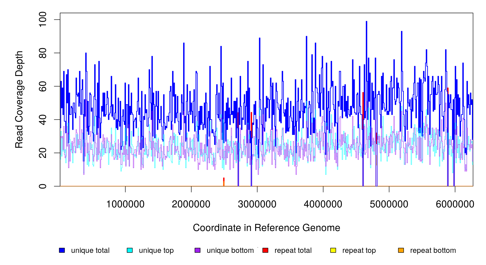
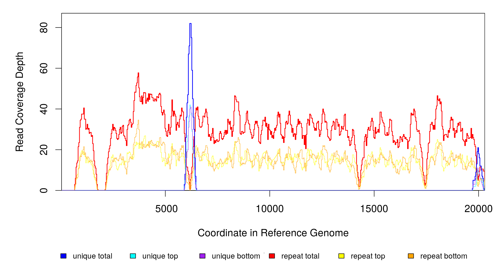
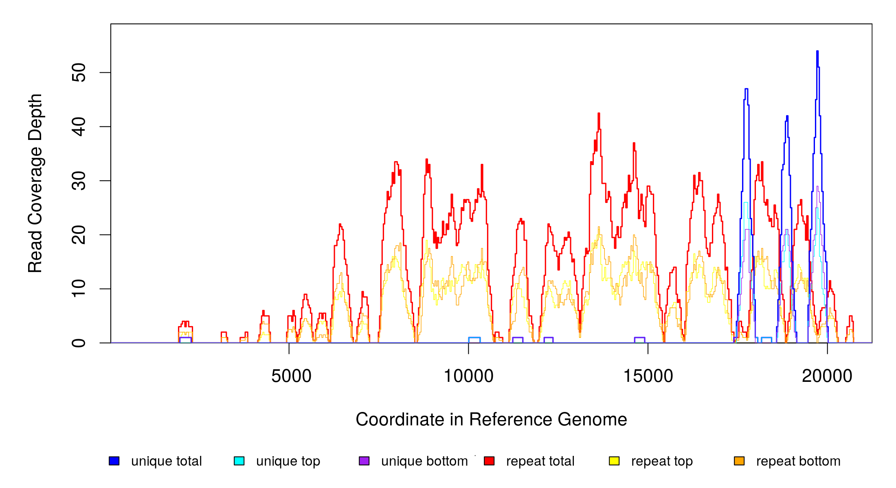
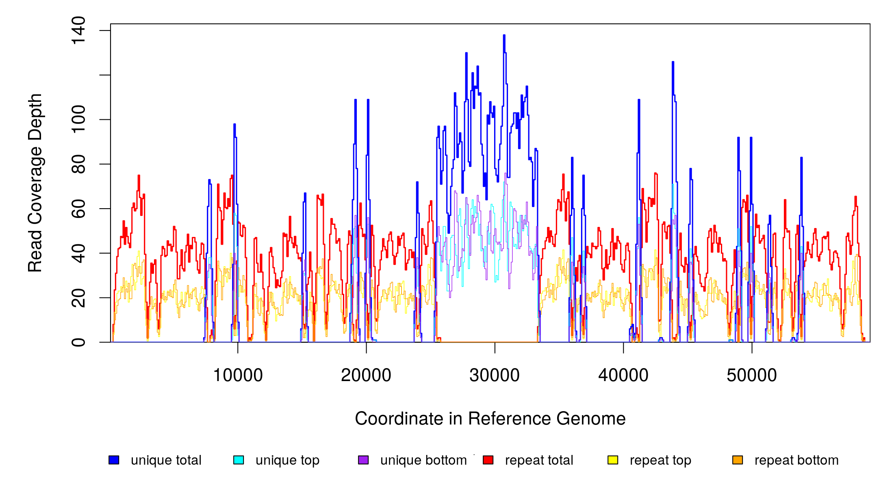
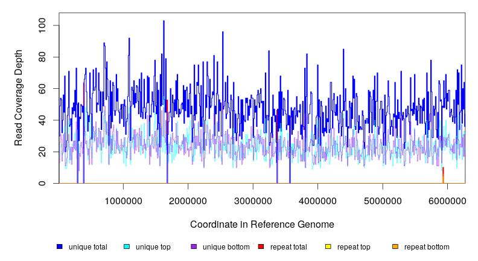
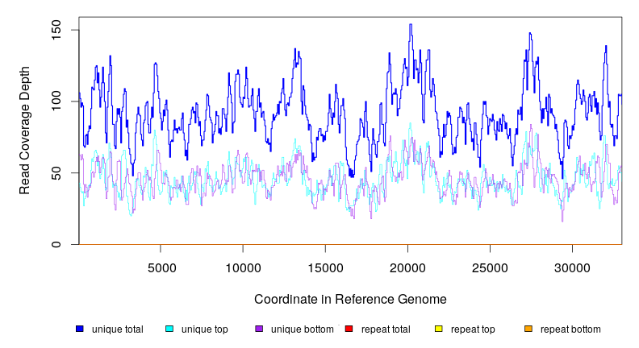

```{r setup, include=FALSE}
## unless noted all analysis was run on the Buenos Aires desktop

knitr::opts_chunk$set(echo=TRUE, 
                      message=FALSE, 
                      error = TRUE,
                      warning=FALSE, 
                      paged.print=FALSE, 
                      fig.align = "center")

knitr::opts_hooks$set(eval = function(options) {
  if (options$engine == "bash") {
    options$eval <- FALSE
  }
  options
})

```


## use nanoplot to get stats on read quality from the nanopore data
```{bash}

conda activate nanopore_utils

RAWDATA=./data/genomics/TDA1000
OUTPUT=./analysis/genomics/TDA1000

NanoPlot -p TDA1000_NP -o $OUTPUT/TDA1000_raw_QCnanoplot/ -t 6 --fastq_rich $RAWDATA/TDA1000_hac.fastq


```

## use porechop to trim reads, remove adapters, etc 

```{bash}

mkdir $OUTPUT/TDA1000_trimmed_subset_fastq

porechop -i $RAWDATA/TDA1000_hac.fastq -o $OUTPUT/TDA1000_trimmed_subset_fastq/TDA1000_hac_trimmed.fastq --threads 6


```


## create single file with illumina reads, as this is needed for racon polishing  
The *merge_ILMreads.py* creates a concatenated file with all R1 and R2 reads. This script is from:
https://github.com/isovic/racon/issues/68#issuecomment-386223150


```{bash}

python merge_ILMreads.py $OUTPUT/TDA1000_trimmed_subset_fastq/trimmed_TDA1000_S7_L001_R1_001.fastq $OUTPUT/TDA1000_trimmed_subset_fastq/trimmed_TDA1000_S7_L001_R2_001.fastq > $OUTPUT/TDA1000_trimmed_subset_fastq/trimmed_TDA1000_merge.fastq

```


## De novo assembly

```{bash}
# Settings
THREADS=4; # (expr $(nproc) - 2) # $(expr $(nproc) / 2)
GENOMESIZE="6.3m";

mkdir -p $OUTPUT/TDA1000_hybridAssembly
mkdir -p $OUTPUT/TDA1000_hybridAssembly/temp
mkdir -p $OUTPUT/TDA1000_hybridAssembly/temp/flye_trim_plasmid
mkdir -p $OUTPUT/TDA1000_hybridAssembly/results
mkdir -p $OUTPUT/TDA1000_hybridAssembly/results/assemblies
```

```{bash}

#trimmed with plasmid option
OUTPUTFILE=results/assemblies/TDA1000_trimmed_flye_plasmid.fa
if [ -s $OUTPUTFILE ]; then echo "$OUTPUTFILE already present";  
else
flye --nano-raw TDA1000_hac_trimmed.fastq --genome-size $GENOMESIZE --threads 2 --plasmid --out-dir temp/flye_trim_plasmid
cp temp/flye_trim_plasmid/assembly.fasta $OUTPUTFILE
fi

```


## Polishing

```{bash, eval=F}

chmod u+x assemblyPolishing_c.sh

nohup bash assemblyPolishing_c.sh > assemblyPolishing_c.out

```


## Assembly quality control  

### checkm
Manual download of the assemblies GCF_000011065.1 and GCF_014131755.1 into the folder **analysis/genomics/TDA1000/TDA1000_hybridAssembly/results/assemblies**
```{bash}

conda activate assemblyQC_20200204

cd analysis/genomics/TDA1000/TDA1000_hybridAssembly/results/assemblies

mkdir assembly_checkm

OUTQC_FULL=analysis/genomics/TDA1000/TDA1000_hybridAssembly/results/assemblies/assembly_checkm
ASSEMB=analysis/genomics/TDA1000/TDA1000_hybridAssembly/results/assemblies


checkm lineage_wf -x fa -t 6 $ASSEMB $OUTQC_FULL -f $OUTQC_FULL/checkm.tsv --reduced_tree --tab_table

```


```{r, message=FALSE,error=FALSE,warning=FALSE}
library(tidyverse)
library(kableExtra)

read_tsv("analysis/genomics/TDA1000/TDA1000_hybridAssembly/results/assemblies/assembly_checkm/checkm.tsv") %>%
  kbl() %>%
  kable_styling()

```


## Run breseq to remap reads against the assembly

```{bash}


ASSEMBfa=analysis/genomics/TDA1000/TDA1000_hybridAssembly/results/assemblies/TDA1000_trimmed_flye_plasmid_raconNPm4_medaka_raconILM_pilonILM.fa
OUT=analysis/genomics/TDA1000/TDA1000_breseq/TDA1000_trimmed_flye_plasmid_raconNPm4_medaka_raconILM_pilonILM
ILMR1=analysis/genomics/TDA1000/TDA1000_trimmed_subset_fastq/trimmed_TDA1000_S7_L001_R1_001.fastq; # path to unzipped illumina forward reads
ILMR2=analysis/genomics/TDA1000/TDA1000_trimmed_subset_fastq/trimmed_TDA1000_S7_L001_R2_001.fastq; # path to unzipped illumina reverse reads


breseq -j 4 -o $OUT -r  $ASSEMBfa $ILMR1 $ILMR2
```

Coverage plots for each contig in the assembly:

contig_2_segment0_pilon - this is the chromosome

```{r,echo=F}

```

contig_3_segment0_pilon - unassigned 20,321bp contig

```{r,echo=F}

```

contig_4_segment3_pilon - unassigned 21,263bp contig

```{r,echo=F}

```

contig_5_segment4_pilon - this is the misassembled plasmid

```{r,echo=F}

```


This indicated to us that the 2 small contigs and the contig corresponding to the plasmid were misassembled. Thus, below we proceed with annotation of the chromosome and then rerun breseq on the de novo assembled chromosome plus the NC_004703 plasmid.

## Annotation of the chromosome

```{bash}

ASSEMBfa=analysis/genomics/TDA1000/TDA1000_hybridAssembly/results/assemblies/TDA1000_trimmed_flye_plasmid_raconNPm4_medaka_raconILM_pilonILM.chromosome.fa
OUT=analysis/genomics/TDA1000/TDA1000_hybridAssembly/results/assemblies/prokka_annotation

prokka --outdir $OUT --prefix TDA1000 --locustag TDA1000 $ASSEMBfa
```


### Create annotation table with matching gene IDs from NC_004663, using blastp  

- Downloaded the gbk file for NC_004663 and then converted to protein fasta with https://rocaplab.ocean.washington.edu/tools/genbank_to_fasta/  

- I had downloaded the sequence of NC_004663, in the 2017 version, before its update on March 10, 2020. This still has gene names as BT_####. The new version has it has BT_RS. But the latter are not recognizable in the literature.  


```{bash}

NCBI=analysis/genomics/TDA1000/TDA1000_hybridAssembly/results/assemblies/prokka_annotation/Btheta_vpi5482_NCBI_chromosome_NC_004663_v2017_proteins_rocapConversion_locusTagOnly.faa

TDA=analysis/genomics/TDA1000/TDA1000_hybridAssembly/results/assemblies/prokka_annotation/TDA1000.faa

cd analysis/genomics/TDA1000/TDA1000_hybridAssembly/results/assemblies/prokka_annotation

makeblastdb -in $NCBI -dbtype prot

blastp -query $TDA -db $NCBI -outfmt "6 qseqid sseqid pident qcovs qlen slen length mismatch gapopen qstart qend sstart send bitscore evalue" > queryTDA_subjectNCBI.txt


```

```{r,eval=FALSE}

library(tidyverse)

# blast resutlts of TDA1000 proteins as query and NCBI proteins as subject
#load data
queryTDA_subjectNCBI<-read_tsv("analysis/genomics/TDA1000/TDA1000_hybridAssembly/results/assemblies/prokka_annotation/queryTDA_subjectNCBI.txt",col_names = c("qseqid_qTDA", "sseqid_qTDA", "pident_qTDA", "qcovs_qTDA", "qlen_qTDA", "slen_qTDA", "length_qTDA", "mismatch_qTDA", "gapopen_qTDA", "qstart_qTDA", "qend_qTDA", "sstart_qTDA", "send_qTDA", "bitscore_qTDA", "evalue_qTDA"))

queryTDA_subjectNCBI$slen_length_relative<-(queryTDA_subjectNCBI$slen_qTDA/queryTDA_subjectNCBI$length_qTDA)*100


# filter at 97% pid, 97% query coverage and 97-103 subject coverage

queryTDA_subjectNCBI<-queryTDA_subjectNCBI[queryTDA_subjectNCBI$pident_qTDA>97 & queryTDA_subjectNCBI$qcovs_qTDA>97 & queryTDA_subjectNCBI$slen_length_relative>97 & queryTDA_subjectNCBI$slen_length_relative<103,]

# get best hit for each gene

queryTDA_subjectNCBI_filter<-queryTDA_subjectNCBI %>% group_by(qseqid_qTDA) %>%
  summarise(min_e=min(evalue_qTDA),max_pid=max(pident_qTDA),max_length=max(length_qTDA))

queryTDA_subjectNCBI_filter$qseqid_filt_qTDA<-paste0(queryTDA_subjectNCBI_filter$qseqid_qTDA,"_",
                                                     queryTDA_subjectNCBI_filter$min_e,"_",
                                                     queryTDA_subjectNCBI_filter$max_pid,"_",
                                                     queryTDA_subjectNCBI_filter$max_length)


# fiter to keep only hits that have the minimum e-value, maximum %ID and maximum alignment length
queryTDA_subjectNCBI$qseqid_filt_qTDA<-paste0(queryTDA_subjectNCBI$qseqid_qTDA,"_",
                                              queryTDA_subjectNCBI$evalue_qTDA,"_",
                                              queryTDA_subjectNCBI$pident_qTDA,"_",
                                              queryTDA_subjectNCBI$length_qTDA)


queryTDA_subjectNCBI<-queryTDA_subjectNCBI[queryTDA_subjectNCBI$qseqid_filt_qTDA %in% queryTDA_subjectNCBI_filter$qseqid_filt_qTDA,]

#get the number of subjects per query
count_qseqid_qTDA<-queryTDA_subjectNCBI %>% group_by(qseqid_qTDA) %>% summarise(count_qseqid=n())

# create two data frames, one for the one-to-one hits, another for the one-to-many hits
qseqid_qTDA_single<-unique(count_qseqid_qTDA[count_qseqid_qTDA$count_qseqid==1,]$qseqid_qTDA)

qseqid_qTDA_multiple<-unique(count_qseqid_qTDA[count_qseqid_qTDA$count_qseqid>1,]$qseqid_qTDA)

queryTDA_subjectNCBI_single<-queryTDA_subjectNCBI[queryTDA_subjectNCBI$qseqid_qTDA %in% qseqid_qTDA_single,]

queryTDA_subjectNCBI_multiple<-queryTDA_subjectNCBI[queryTDA_subjectNCBI$qseqid_qTDA %in% qseqid_qTDA_multiple,]

queryTDA_subjectNCBI_multiple2<-aggregate(data=queryTDA_subjectNCBI_multiple,sseqid_qTDA~qseqid_qTDA,FUN=paste)


queryTDA_subjectNCBI_multiple<-left_join(queryTDA_subjectNCBI_multiple2,queryTDA_subjectNCBI_multiple[-2] %>% distinct())

queryTDA_subjectNCBI_multiple$sseqid_qTDA<-as.character(queryTDA_subjectNCBI_multiple$sseqid_qTDA)


queryTDA_subjectNCBI_dat<-bind_rows(queryTDA_subjectNCBI_single,queryTDA_subjectNCBI_multiple)


#read gff and merge and create dataframe with all gene names

tda1000_gff<-rtracklayer::readGFF("analysis/genomics/TDA1000/TDA1000_hybridAssembly/results/assemblies/prokka_annotation/TDA1000.gff")

tda1000_gff<-as.data.frame(tda1000_gff)

tda1000_gff<-tda1000_gff %>%
  select("locus_tag","start","end","strand","type","product")


colnames(tda1000_gff) <- paste0(colnames(tda1000_gff),"_prokka")


annotation_table<-left_join(tda1000_gff,queryTDA_subjectNCBI_dat,by=c("locus_tag_prokka"="qseqid_qTDA"))


annotation_table$sseqid_qTDA[is.na(annotation_table$sseqid_qTDA)] <- "ND"

# writexl::write_xlsx(annotation_table,"analysis/genomics/TDA1000/TDA1000_hybridAssembly/results/assemblies/prokka_annotation/annotation_table.xlsx")


```

I then manually edited this file to correct the genes that had multiple matches, in the following way:  

- attributing a gene name based on synteny  
- whenever there were more copies in our de novo assembly than in NC_004663, we attributed the name of the first gene to the non-synthenic copies 

Moreover, I generated the file annotation_table_short.xlsx with just the columns: locus_tag_prokka and the sseqid_qTDA. The later was renamed to locus_tag_db

## Run breseq to remap reads against the assembly and polish assembly

#### edit gbk file
We need the gene names in the breseq reports to be TDA1000_#####. Though breseq will attempt to name genes by the /gene field in the gbk, if this is available. These names tend to be of the format "abcD". To avoid this, I created a new gbk file in which all /gene fields have been deleted

```{bash}
D=analysis/genomics/TDA1000/TDA1000_hybridAssembly/results/assemblies/prokka_annotation

awk '!/gene\=/' $D/TDA1000.gbk > $D/TDA1000_v2.gbk
```

#### run breseq

```{bash}

conda activate breseq0.34.1

PLASMID=analysis/genomics/TDA1000/TDA1000_hybridAssembly/results/assemblies/Btheta_vpi5482_NCBI_plasmid.gb
CHROMOS=analysis/genomics/TDA1000/TDA1000_hybridAssembly/results/assemblies/prokka_annotation/TDA1000_v2.gbk
ILMR1=analysis/genomics/TDA1000/TDA1000_trimmed_subset_fastq/trimmed_TDA1000_S7_L001_R1_001.fastq; # path to unzipped illumina forward reads
ILMR2=analysis/genomics/TDA1000/TDA1000_trimmed_subset_fastq/trimmed_TDA1000_S7_L001_R2_001.fastq; # path to unzipped illumina reverse reads
OUTDIR=analysis/genomics/TDA1000/TDA1000_breseq/TDA1000_v2


nohup breseq -j 6 -o $OUTDIR -r $CHROMOS -r $PLASMID $ILMR1 $ILMR2 &


```

#### Vizualize coverage profiles
contig_2_segment0_pilon - this is the chromosome

```{r,echo=F}

```

NC_004703 - plasmid

```{r,echo=F}

```


#### change reference genome by adding mutations detected by breseq in the ancestrals

```{bash}

cd analysis/genomics/TDA1000/TDA1000_breseq/TDA1000_v2

GD=analysis/genomics/TDA1000/TDA1000_breseq/TDA1000_v2/output/output.gd

gdtools APPLY -o TDA1000_chromosome_plasmid.gff3 -f GFF3 -r $CHROMOS -r $PLASMID $GD

cp TDA1000_chromosome_plasmid.gff3 analysis/genomics/TDA1000/TDA1000_hybridAssembly/results/assemblies/prokka_annotation

```

TDA1000_chromosome_plasmid.gff3 was then edited in Atom by replacing "contig_2_segment0_pilon" by "chromosome"  and "NC_004703" by "plasmid". This created TDA1000_chromosome_plasmid_v2.gff3.

## IS annotation

prokka only annotates the transposases and not full IS sequences. In order to obtain these, I ran the chromosome sequence through the tool ISSaga (http://issaga.biotoul.fr/ISsaga2/issaga_login.php?type=2). This generated a GFF file with 40 predicted transposons. These were manually entered into the file TDA1000_chromosome_plasmid_v2.gff3, thereby generating TDA1000_chromosome_plasmid_v3.gff3. Importantly, this also helps solving another issue, as the main tag on the IS sequences from ISSaga is repeat_region and breseq will only recognize IS sequences that are tagged like this (or as mobile_element; see https://github.com/barricklab/breseq/issues/124#issuecomment-312542805).

